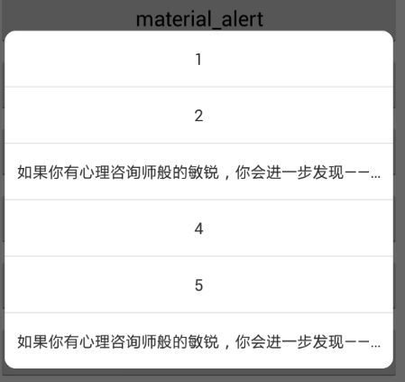
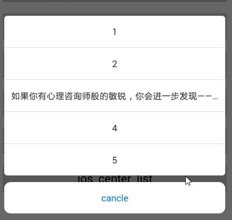
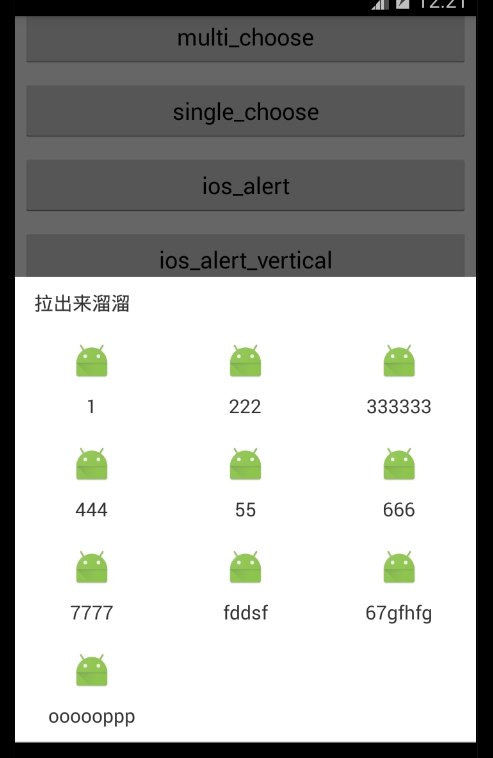

原作者链接：https://github.com/hss01248/DialogUtil
修复了一下点击返回键和外界依然会取消的小bug

# DialogUtil
material风格(v7支持包中的)，ios风格，传入context构建，可在任意界面弹出，以及dialog样式的activity(todo)


# 特性

loading对话框和ios风格的dialog传入context和activity均可弹出dialog.

样式包括常用的ios风格dialog和meterial design风格的dialog.

可以传入自定义的view,定义好事件,本工具负责显示

考虑了显示内容超多时的滑动和与屏幕的间隙.


# 更新

1.ios风格的按钮颜色改成ios的蓝色(图中蓝色不正是因为total control 截图后偏色)

2.按钮添加按下的效果

3.增加meterial design的单选和多选,增加ios风格的输入框

4.增加传入自定义的view(此时工具类作为一个壳,view相关数据样式和回调自己实现.)

## 2016-10-20

1.增加转菊花的loading效果

2.bottomsheet 加上listview和gridview,只需要设置图标和文字

参考:

http://blog.csdn.net/qibin0506/article/details/51002241
http://www.cnblogs.com/warnier-zhang/p/4904296.html
http://www.jianshu.com/p/21bb14e3be94/comments/1570995  坑

https://github.com/android-cjj/BottomSheets


# todo


1.windows风格的dialog

2.md风格按钮样式无法自定义的bug

3.bottomsheet 图标大小和文字大小的自定义


# 示例图

 


  


 


 


 


ios风格(含按下效果)


 


 


 


 


 


bottomsheet:

  


 


gridview拉出来时:

 


# useage


## gradle

**Step 1.** Add the JitPack repository to your build file

Add it in your root build.gradle at the end of repositories:

```
	allprojects {
		repositories {
			...
			maven { url "https://jitpack.io" }
		}
	}
```

**Step 2.** Add the dependency

```
	dependencies {
	       // compile 'com.github.hss01248:DialogUtil:1.0.0'
	}
```


## 示例代码(MainActivity里)


```
//通过普通的activity 弹出进度条(转圈圈)
StyledDialog.showProgressDialog(this,msg,true,true);

//通过context弹出进度条
gloablDialog=   StytledDialog.showMdLoading(getApplicationContext(),msg,true,true);

//meterial design 样式的alertdialog:
 StyledDialog.showMdAlert(this, "title", msg, "sure", "cancle", "think about", true, 	true, new MyDialogListener() {
                    @Override
                    public void onFirst() {
                        showToast("onFirst");
                    }

                    @Override
                    public void onSecond() {
                        showToast("onSecond");
                    }

                    @Override
                    public void onThird() {
                        showToast("onThird");
                    }


                });
                
 //ios样式的提示框:( StytledDialog.showIosAlertVertical(...)为按钮竖直方向上排列的对话框)
 
StyledDialog.showIosAlert(this, "title", msg, "sure", "cancle", "think about", true, true, new MyDialogListener() {
                    @Override
                    public void onFirst() {
                        showToast("onFirst");
                    }

                    @Override
                    public void onSecond() {
                        showToast("onSecond");
                    }

                    @Override
                    public void onThird() {
                        showToast("onThird");
                    }


                });
  
  //底部弹出的带或不带取消按钮的弹窗
  
   final List<String> strings = new ArrayList<>();
                strings.add("1");
                strings.add("2");
                strings.add(msg);

	StyledDialog.showBottomItemDialog(activity, strings, "cancle", true, true, new MyItemDialogListener() {
                    @Override
                    public void onItemClick(String text,int position) {
                        showToast(text);
                    }

                    @Override
                    public void onBottomBtnClick() {
                        showToast("onItemClick");
                    }
                });}
   //输入框:
   
     StyledDialog.ShowNormalInput(activity, "登录", "请输入用户名", "请输入密码", "登录", "取消", true, new MyDialogListener() {
                   @Override
                   public void onFirst() {

                   }

                   @Override
                   public void onSecond() {

                   }

                   @Override
                   public void onGetInput(CharSequence input1, CharSequence input2) {
                       super.onGetInput(input1, input2);
                       showToast("input1:"+ input1 +"--input2:"+input2);
                   }
               });
  
  
  //中间弹出的条目弹窗
  
   final List<String> strings = new ArrayList<>();
                strings.add("1");
                strings.add("2");
                strings.add(msg);
                
   StyledDialog.showIosSingleChoose(activity, strings, true, true, new MyItemDialogListener() {
                    @Override
                    public void onItemClick(String text,int position) {
                        showToast(text);
                    }

                    @Override
                    public void onBottomBtnClick() {
                        showToast("onItemClick");
                    }
                });
```


## context弹出dialog注意事项

弹出后对后退键的响应需要自己写代码:

```
Dialog gloablDialog;//用一个统一的变量名存引用

@Override
public void onBackPressed() {

    if (gloablDialog != null && gloablDialog .isShowing()){
        gloablDialog.dismiss();
    }else {
        super.onBackPressed();
    }
}


```

